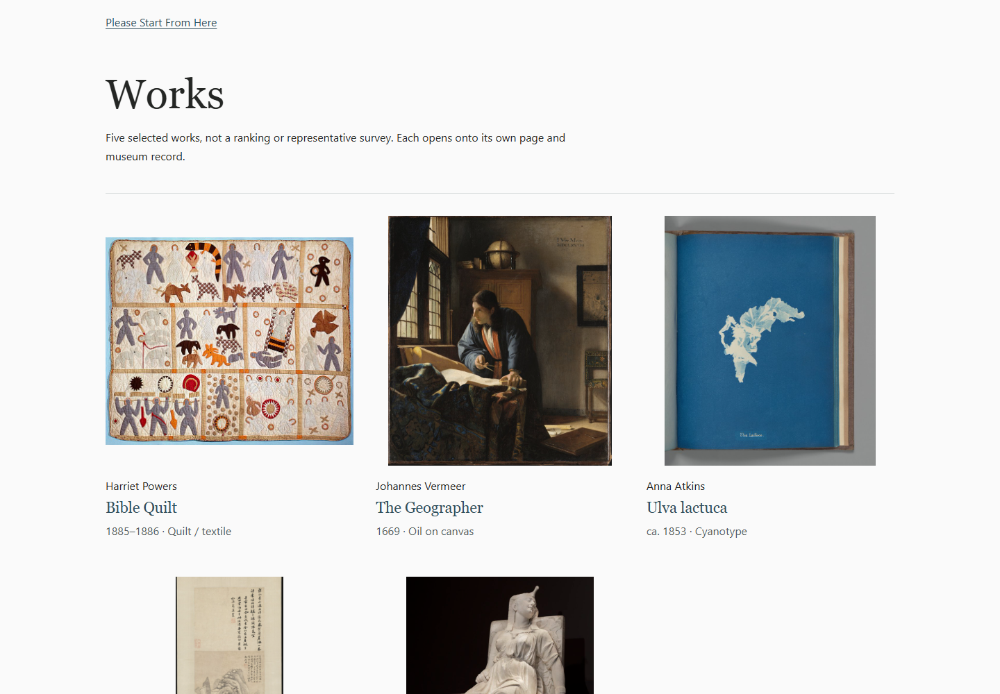

# Works publication-treatment candidate

Source-only preparation for a release decision. Not merged or published.

Parent: PR134 `b078c3cf4aa251c4226985c2547d03e3d88b196a`.
Direction: PR134 comment `5607917054`; corrected basis: COM108 `5607927467`.
CC's prior KEEP concerns `da81436`, not this changed candidate.

## What changes

- Six HTML pages lose their unpublished/local-review wrapper labels and noindex
  directives. Powers also loses the associated nofollow directive.
- The shelf says "Five selected works, not a ranking or representative survey."
  Its non-endorsement sentence remains. The redundant former preview-label
  paragraph is removed, leaving the existing home link and Works heading.
- The sitemap gains exactly six URLs: shelf and five work pages.
- Six delivery pins change explicitly. The original reviewed-file declarations,
  source-review commit and checksum-provenance limitation remain unchanged.

The 36-file Works set is unchanged. All30 non-HTML files, including all16 images,
styles and source/rights records, retain exact parent bytes. The new regression
test resolves the actual pinned PR134 parent from Git and checks every copied
file: six literal wrapper transformations,30 unchanged files. This is a bounded
comparison with that integration, not a new independent check of museum provenance.

No homepage, Homer, site stylesheet, build logic, llms, seed, start.json or
manifest change. The existing manifest already exposes Works as optional, with
no required traversal/report-back and no claim that art is TRACE/ME evidence.
Vermeer's historical phrase "acquired for this preview" remains in its source-tier
account; it describes the acquisition, not the page's current publication status.
No privacy claim, gallery branding, new media acquisition or edition bump.

## Checks and limits

- Normal build PASS.17 Node tests PASS;22 existing Python tests PASS.
-154 normal output files delivered exactly by the preview-server test.
-435 local references and10 HTML anchors across36 HTML pages: no missing target.
- Existing visible-route check PASS. Exact sitemap addition checked against the
  historical remainder; the unchanged404 page retains noindex.
- Eight final Edge152.0.4191.66 viewport captures, JavaScript disabled, DPR1:
  shelf1440/16,390/16,390/32; Powers390/32; Vermeer1440/16; Atkins390/16;
  Shen390/32; Lewis1440/16. Every served HTML response was matched byte-for-byte
  with the final build before capture. All images loaded; no measured horizontal
  overflow. See `renders.json` for HTML hashes and geometry.
- Viewport-only observation, not full-page screenshots, physical-device testing,
  native zoom, screen-reader testing, exhaustive keyboard review or reader benefit.

Two instrument mistakes were corrected during this work. The first new test
compared Git-text files against Windows checkout bytes without accounting for
their CRLF checkout policy; that text-only comparison now normalizes CRLF. The
byte-pinned Works files are still compared without normalization. Also, the local
preview server snapshots files when started: an early attempted shelf recapture
still showed the old wrapper after rebuilding. The server was restarted and all
eight final views reacquired with response/build byte checks. Earlier captures
are not used as final evidence.

## Look at the candidate

These are local-candidate screenshots, not captures of the public website.

[Normal mobile shelf](shelf-mobile.png) ·
[Mobile shelf with enlarged text](shelf-mobile-large.png) ·
[Powers, enlarged mobile](powers-mobile-large.png) ·
[Vermeer, desktop](vermeer-desktop.png) ·
[Atkins, mobile](atkins-mobile.png) ·
[Shen, enlarged mobile](shen-mobile-large.png) ·
[Lewis, desktop](lewis-desktop.png)

## Release boundary

This branch depicts a proposed public treatment; removing noindex here does not
publish it. Maintained source and gh-pages are untouched. A release decision must
name the exact accepted candidate and deal with deployment separately. Reuse of
unchanged bytes retains their earlier observations, not a blanket review of this
new head or proof that the collection helps its readers.
